# erddap-places: UI assessment for the MBON-branded re-layout

Written 2026-10-08 against the live app, https://oceanmetrics.io/erddap-places/ (main at `fe8a1fc`).
The target is the calcofi.io/explore layout (`~/Github/CalCOFI/docs/explore.qmd`): one map as the page,
a title sentence that is also the controls, a numbered Controls pane, Time along the bottom, one pill
on the right edge, every pane with the same bar, every view a URL, Help ▾ / feedback / theme in the
header, and "built by Ocean Metrics" in the footer. Information should read **dataset → place →
method → delivery**, with nothing on screen the user did not need for the question "what is this map
of, where, computed how, and how do I take it with me".

Screenshots are in `docs/ui-assessment/`, taken with Playwright Chromium (SwiftShader WebGL) after the
status line read `done:` (statistics) or the then-now footer carried its request timing, then network
idle + 2 s. The app has no theme, so light only. The script that took them is
`docs/ui-assessment/shoot.mjs` (`node shoot.mjs ep | oh | shiny`, run with `playwright` resolvable and
a writable `TMPDIR`).

## 1. What the app looks like now

### Place statistics (default view)

| | phone 390×844 | laptop 1280×800 | projector 1920×1080 |
|---|---|---|---|
| initial (HIHWNMS × dhw_5km CRW_SST, auto-run) | 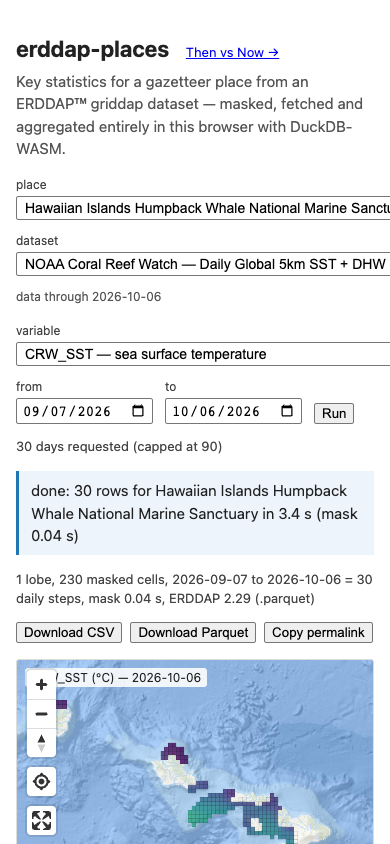 | 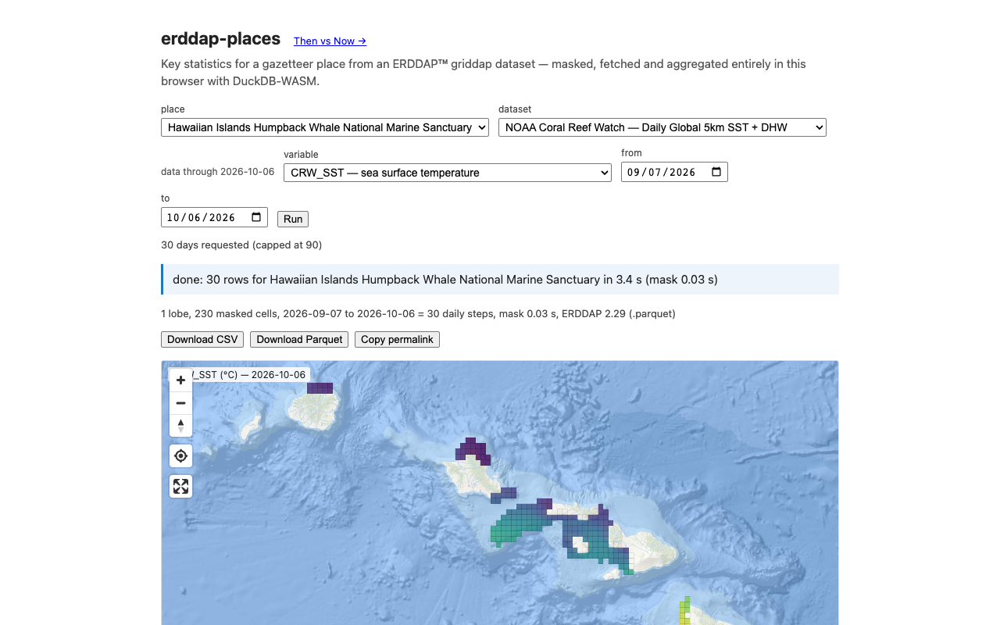 | 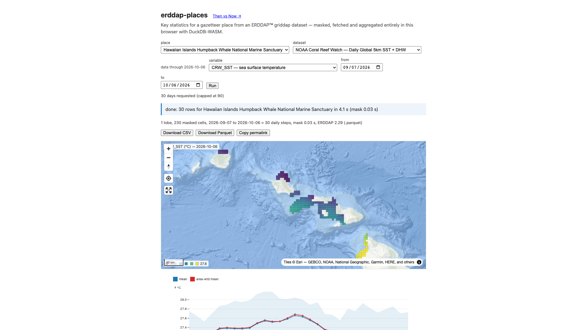 |
| loaded: FKNMS × dhw_5km CRW_SST, last 30 days | 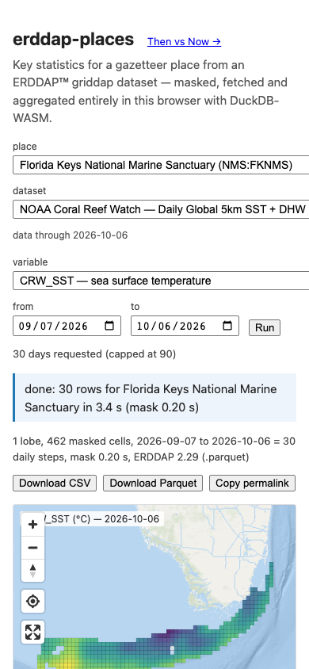 | 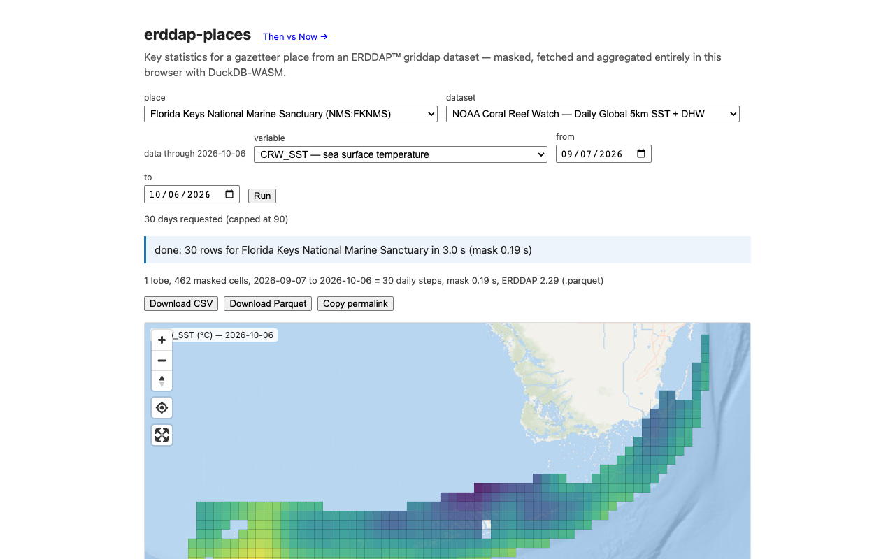 | 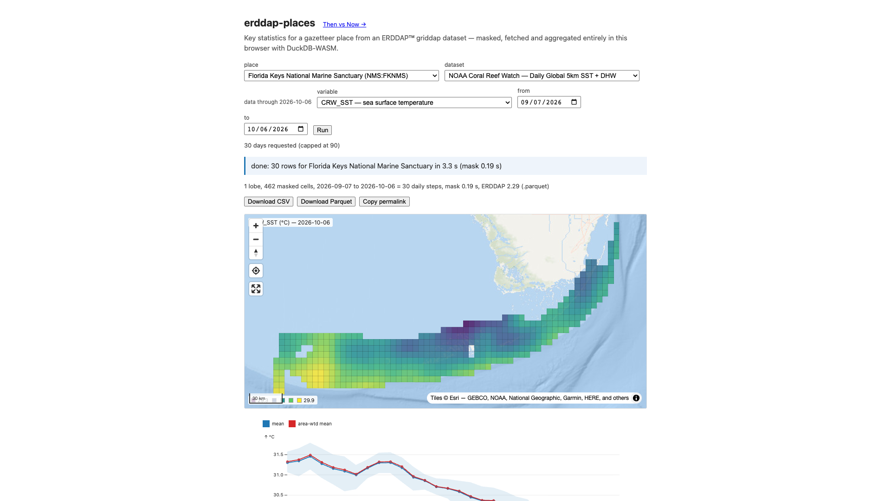 |

Whole page (scroll) at laptop width: 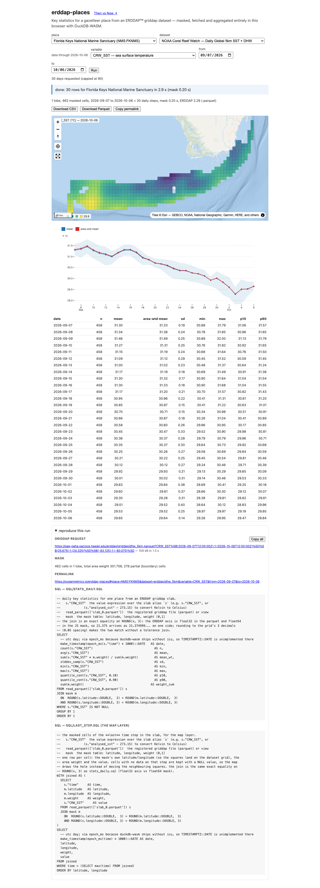

Annotations, top to bottom on the FKNMS page (1280 × 3542 px of document for one answer):

1. **Header** `erddap-places` + "Then vs Now →" link + a two-line subtitle about DuckDB-WASM. No
   brand, no help, no theme, no feedback. The product name is the repo name.
2. **Five pickers + Run** in a wrapping flex row: place, dataset, *data through 2026-10-06* (floats
   between pickers), variable, from, to, Run. At 1280 the row wraps so `to` and Run sit alone on a
   third line.
3. **Three readouts saying one thing**: "30 days requested (capped at 90)"; the blue status box
   "done: 30 rows for Florida Keys National Marine Sanctuary in 2.9 s (mask 0.20 s)"; the meta line
   "1 lobe, 462 masked cells, 2026-09-07 to 2026-10-06 = 30 daily steps, mask 0.20 s, ERDDAP 2.29
   (.parquet)".
4. **Download CSV / Download Parquet / Copy permalink** buttons, above the map.
5. **Map** (420 px tall) begins at y ≈ 460 of 800 at laptop: the answer is below the fold. Its title
   "CRW_SST (°C) — 2026-10-06" is clipped under the zoom buttons ("_SST (°C) — …"); the legend sits on
   top of the scale bar. It shows only the **last** day of the window, which nothing says outright.
6. **Chart**: mean and area-weighted mean as two lines that differ by ≤ 0.04 °C here, so one hides the
   other; a p10–p90 band.
7. **Table**: 30 rows × 9 columns, always open.
8. **"reproduce this run"**, open by default: griddap URL, mask summary, the permalink a second time,
   and two full SQL templates (~70 lines).

Phone: the place and dataset selects run past the right edge (fixed `max-width: 420px` wider than the
viewport); the map starts below the first screen; the 9-column table overflows horizontally.

### Then vs Now (`#mode=then-now`, FKNMS default)

| phone | laptop | projector |
|---|---|---|
| 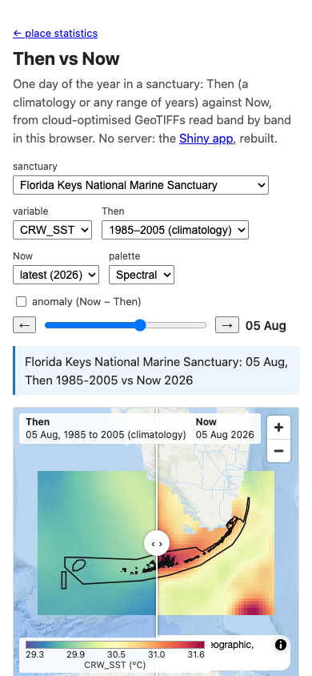 | 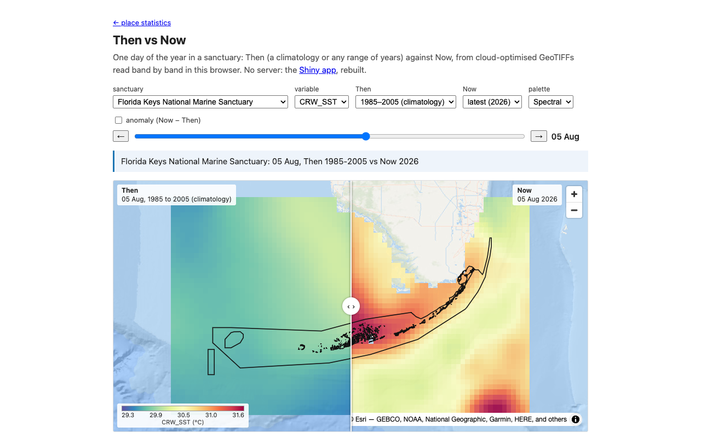 | 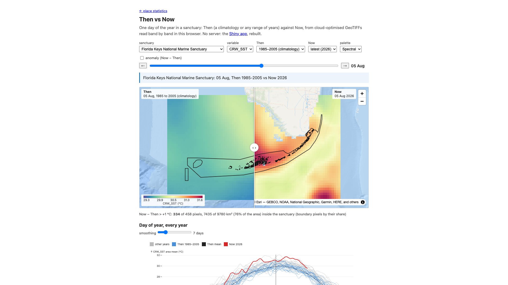 |

Whole page: 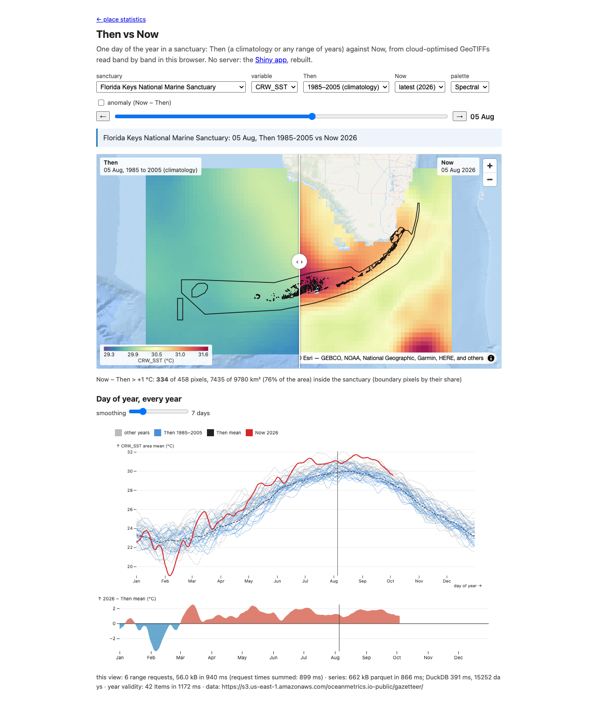
Anomaly on (`&anom=1`): 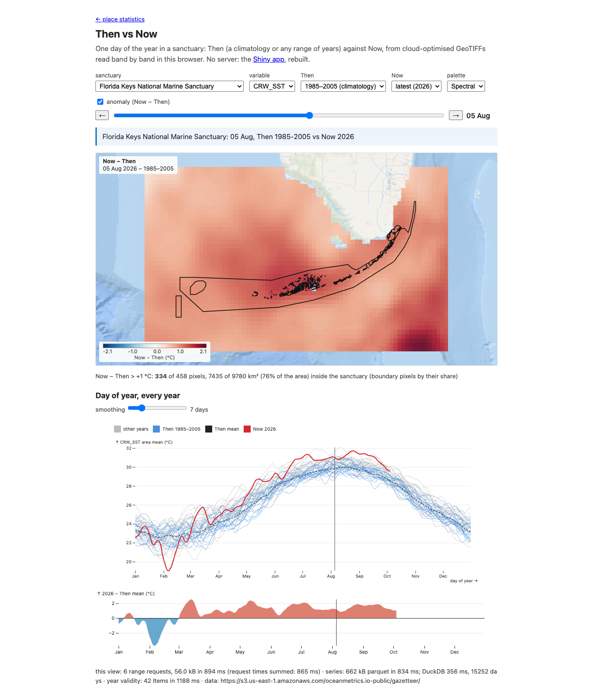

1. A different page with its own header ("← place statistics", "Then vs Now", subtitle crediting the
   Shiny app) — the two modes do not share a frame, so switching is a reload.
2. Pickers: sanctuary, variable, Then (climatology or custom years, which adds two number inputs),
   Now, palette, anomaly checkbox; then a day slider with ← → and the day label.
3. Status box repeats the view title ("Florida Keys …: 05 Aug, Then 1985-2005 vs Now 2026").
4. Swipe map with a Then label (left) and Now label (right), one shared colour bar bottom left. The
   rasters cover the bbox + 20 % and are not masked, so the map shows more sea than the statistics use.
5. **The best readout in either mode sits in small grey text under the map**: "Now − Then > +1 °C:
   334 of 458 pixels, 7435 of 9780 km² (76 % of the area) inside the sanctuary". It shows even when
   the anomaly is off.
6. "Day of year, every year" with a smoothing slider; then the Now-year anomaly series.
7. Footer: request counts, kB, ms (three timings), Item validity, and the raw S3 root URL.

Phone: the controls take half the first screen; the colour bar overlaps the Esri attribution.

### The Shiny app it replaces (nms-cc), 1280×800

| map tab | plot tab |
|---|---|
| 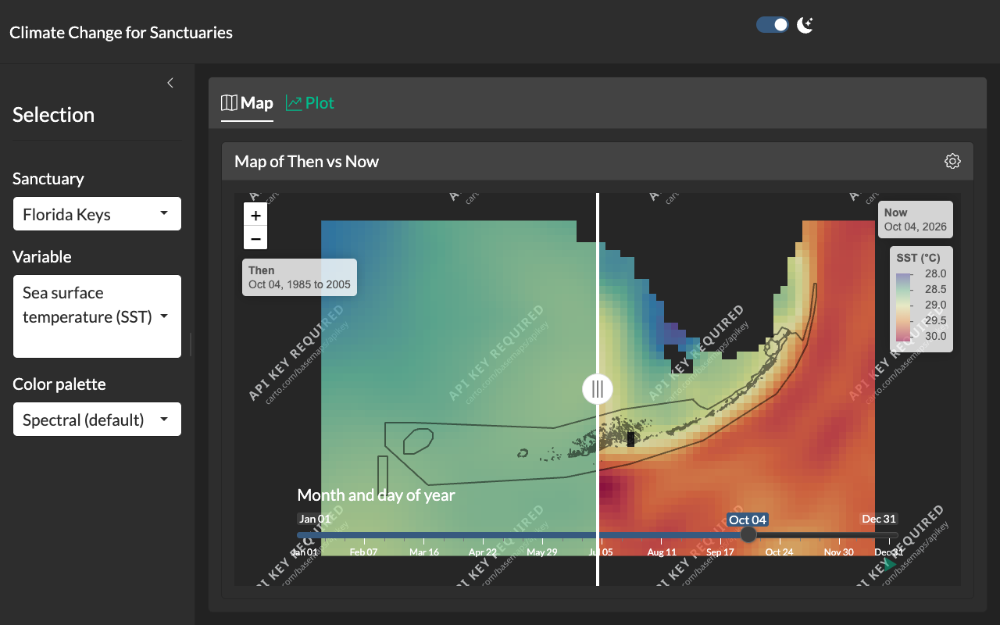 | 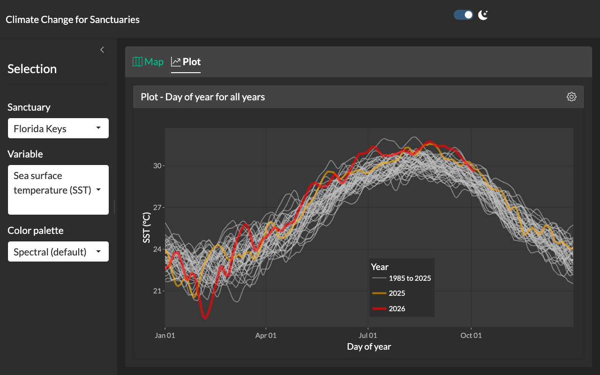 |

There is no Shiny counterpart of the statistics view.

## 2. Inventory

Grades are from the user's side: **P** primary (asked every visit), **S** secondary (changes the
answer, asked sometimes), **R** rarely used (provenance, debugging, power use).

### Place statistics

| control / readout | where now | what it does | when it matters | grade |
|---|---|---|---|---|
| place select (NMS / MRGID / PSGID optgroups, "Name (ID)") | picker row, 1st | sets the polygon | every view | P |
| click a place on the map | map | same as the select | browsing | P |
| dataset select (18, some "pending") | picker row, 2nd | sets the ERDDAP source | every view | P |
| variable select ("CRW_SST — sea surface temperature") | picker row | sets the variable; categorical ones switch template | every view | P |
| *data through YYYY-MM-DD* | floating between pickers | the server's last time step | when choosing dates | S (fold into the dataset chip) |
| from / to date inputs | picker row | the window, clamped to the extent | to change the window | P (as a time brush) |
| Run / "Run (supersedes)" | picker row | starts the run; the app already auto-runs on load | after any change | S (remove: run on change) |
| "N days requested (capped at 90)" | under pickers | the window length and the cap | only when the cap bites | R |
| status box ("done: 30 rows … 2.9 s") | full-width box | progress / error | while loading, on error | S (as a transient toast / pane spinner) |
| meta line (lobes, cells, steps, mask s, ERDDAP version) | under status | mask and server detail | provenance | R |
| Download CSV, Download Parquet | button row | the per-day table | delivery | P (in Share) |
| Copy permalink | button row | the URL | delivery | P (in Share) |
| map: place outlines, selected fill | map | context, place picking | always | P |
| map: last-time-step squares + hover (value, area weight) | map | the spatial pattern on one day | to see where | P |
| map title ("CRW_SST (°C) — date") | map, top left, clipped | which day the squares are | always | P (into the sentence) |
| legend (5 swatches + max) | map, bottom left, over scale bar | colour scale | always | P (under the sentence) |
| zoom, compass, locate, fullscreen | map, top left | map navigation | sometimes | S (locate: R) |
| chart: mean + area-weighted mean + p10–p90 | below map | the time series answer | every view | P |
| chart: stacked class fractions (categorical) | below map | the categorical answer | categorical vars | P |
| chart: monthly mean + min–max (tabledap) | below map | point datasets | CalCOFI bottle etc. | P |
| table (daily / per class / monthly) | below chart, always open | the numbers | to read or copy values | S |
| reproduce: griddap URL(s) + kB + s | details, open | the exact request | provenance | R |
| reproduce: mask summary | details | cells, lobes, weight, partial cells | method check | S (the cell count goes into the sentence) |
| reproduce: permalink (again) | details | duplicate of Copy permalink | never needed twice | R (remove) |
| reproduce: SQL × 2, Copy all | details | the queries | reproduce / teach | R (Share → SQL and timing) |
| "Then vs Now →" | header link | switches mode with a reload | to compare to a baseline | P (as a Method choice) |

### Then vs Now

| control / readout | where now | what it does | when it matters | grade |
|---|---|---|---|---|
| sanctuary select (13; TBNMS absent) | picker row | place | every view | P |
| variable select (CRW_SST only today) | picker row | variable | when a second exists | P (one chip) |
| Then select (1985–2005, 2003–2012, custom) + from/to years | picker row | baseline | to change the baseline | P |
| Now select (latest / a year) | picker row | the compared year | sometimes | P |
| palette (Spectral / viridis) | picker row | colour ramp | almost never | R |
| anomaly checkbox | own line | Now−Then map + diverging ramp | the key question | P (method chip) |
| day slider + ← → + label | own line | the day of year | every view | P (as the Time pane) |
| status box (repeats the title) | full-width box | progress / title | while loading | R |
| swipe handle, Then / Now labels | map | compare the two | every view | P |
| colour bar (shared scale) | map, bottom left | scale | always | P (under the sentence) |
| hover readout | map | pixel value(s) | to read one place | S |
| exceedance line (334 of 458 pixels, 76 % of area > +1 °C) | grey text under map | the headline number | every anomaly view | P (promote into the sentence) |
| day-of-year chart (all years, Then blue, Now red, mean dashed) | below | the context for the day | every view | P (bottom pane) |
| smoothing slider (1–31 days) | above chart | smoothing | rarely | R (pane menu) |
| anomaly series of the Now year | below chart | how unusual the year is | often | S (second mode of the bottom pane) |
| footer: requests, kB, ms, Items, S3 root | page foot | cost and provenance | debugging | R (Share → SQL and timing) |
| "← place statistics" | top link | back to the other mode | sometimes | S (Method choice) |

### What nms-cc (Shiny) had that the Svelte app lacks

- **Dark theme** toggle in the header (nms-cc opens dark).
- **Play** button on the day slider (animates through the year). Useful on a projector.
- **The previous year highlighted** in the day-of-year plot (2025 in orange beside 2026 in red).
- **Opens on the latest day with data** (nms-cc opened on Oct 04 2026); then-now opens on `md=08-05`.
- **Then/Now year-range sliders** under a settings gear (the Svelte app has the same through the Then
  select's custom range: parity, different place).
- **Interactive plot**: plotly hover and zoom on the yearly curves (the Svelte chart has titles only).
- A collapsible sidebar and Map / Plot tabs (the Svelte page shows both, which is better).

The Svelte app adds what nms-cc never had: the anomaly map, the exceedance in pixels and km², a custom
baseline, the anomaly series, permalinks, and ~56 kB per first view with no server.

## 3. Clutter

- **Everything is open at once.** Pickers, three status lines, export buttons, map, chart, 30-row
  table and a 70-line SQL block are all expanded: 3542 px of page for one answer.
- **The answer is below the fold** (map at y ≈ 460 / 800) and the map is a fixed 420 px strip at
  1920 × 1080, leaving most of a projector white.
- **Redundant readouts**: requested days + status + meta line; permalink twice; the then-now status
  box repeats the title; the exceedance shows when anomaly is off.
- **Labels competing with data**: the map title is clipped by the zoom buttons; the legend overlaps the
  scale bar; then-now's colour bar overlaps the attribution at phone width.
- **Footer noise**: then-now's footer is three timings and a bucket URL; statistics has its own in the
  meta line. Both belong under Share → *SQL and timing*.
- **Codes before words**: "CRW_SST — sea surface temperature", "Florida Keys … (NMS:FKNMS)", "dhw_5km"
  in the URL. Lead with the words, keep the code in the hover and the URL.
- **Two near-identical lines** (mean, area-weighted mean): show area-weighted by default; the
  unweighted mean belongs in the table and the CSV.
- **Run button on an app that already runs itself** on load: pick-then-Run is a second step the
  sentence model does not need (the run-token abort logic already supports run-on-change).
- **Then-now is a separate page.** It is the same place and the same variable with a different method;
  the user should not reload to change method.
- **Controls that could be sentence chips**: place, dataset, variable, window, method
  (window statistics / then vs now / anomaly), baseline, Now year, day.
- **What breaks at phone width**: selects overflow; the map starts below the first screen; the tables
  scroll sideways; the colour bar sits on the attribution.

## 4. Cut list

| item | decision |
|---|---|
| subtitle about DuckDB-WASM | remove (About in Help ▾) |
| "Then vs Now →" / "← place statistics" links | fold into the sentence (Method chip) |
| place, dataset, variable, from/to, Then, Now, day, anomaly | fold into the sentence; also in Controls |
| *data through* | fold into the sentence (dataset chip menu shows the span) |
| Run | remove (run on change; the pane shows a spinner, the run is superseded as now) |
| "N days requested (capped at 90)" | remove; show the cap only when it bites, as a note on the time brush |
| status box | remove as a block; loading spinner on the pane bar, errors as a toast |
| meta line (lobes, mask s, ERDDAP version) | fold under Share → *SQL and timing*; the cell count goes into the sentence |
| Download CSV / Parquet, Copy permalink | fold under Share (and the pane ⬇ for CSV/PNG/SVG) |
| map title on the map | remove (the sentence carries the date) |
| legend | keep, under the sentence |
| zoom / compass / fullscreen | keep (top right row); locate: remove |
| chart (stats) | keep, as the Time pane |
| unweighted mean line | remove from the chart (keep in table / CSV) |
| table | fold into the right-edge pane (collapsed pill) and the pane CSV |
| reproduce panel (URLs, mask, SQL, Copy all) | fold under Share → *SQL and timing* / *Copy code* |
| second permalink | remove |
| palette select | fold under Method → *More options* |
| smoothing slider | fold into the Time pane's ⋯ menu |
| exceedance line | fold into the sentence (anomaly method) |
| then-now status box, footer timings, S3 root | fold under Share → *SQL and timing* |
| footer | keep one line: MBON · built by Ocean Metrics · data credits · source · version |

## 5. Proposed main view

**Title sentence** (dataset → place → method; every underlined part a chip):

- statistics: "**Sea surface temperature** (NOAA Coral Reef Watch, 5 km, daily) in **Florida Keys
  National Marine Sanctuary**, **area-weighted mean** of 462 cells, **7 Sep – 6 Oct 2026**; map:
  **6 Oct 2026**." Colour scale and "462 cells · 278 on the boundary" beneath.
- then vs now: "**Sea surface temperature** in **Florida Keys NMS** on **5 Aug**: **2026** against
  **1985–2005**" and, with the anomaly on, "… **Now − Then**: 76 % of the sanctuary (7,435 of
  9,780 km²) is more than +1 °C warmer."

**Controls tabs.** The asked-for order, ① Place ② Dataset & variable ③ Method ④ Share, is right for
the tabs even though the sentence reads dataset first: users arrive with a place (`?place=` from a
sanctuary page), and the place filters the dataset list (the CalCOFI bottle and the CMEMS products are
regional; then-now exists for 13 sanctuaries only), so picking the place first prevents dead choices.

1. **① Place**: gazetteer search (name, not ID; grouped Sanctuaries / Marine regions / other), the map
   click, and a one-line place card (area, cells at the current grid).
2. **② Dataset & variable**: datasets grouped by theme with the span and resolution on each row
   ("daily · 5 km · 1985 – 6 Oct 2026"), only those covering the place; then the variable in words.
3. **③ Method**: *Window statistics* (the default) | *Then vs Now* | *Anomaly*; for statistics the
   weighting and the template note for categorical variables; for then-now the baseline (climatology
   or a year range) and the Now year. *More options*: palette, smoothing, the unweighted mean.
4. **④ Share**: Copy link; Download CSV / Parquet / zip (table + SQL + griddap URL + README +
   citation); Copy code (SQL, R, Python; the SQL is already in `sql/`); Cite this data (ERDDAP dataset
   citation + gazetteer); PNG of the view; Send feedback; *SQL and timing* (what the meta lines and
   footers hold now).

**Bottom pane (Time).** Statistics: the daily series (area-weighted mean with p10–p90) over the whole
available record context, with the window as a brush, so dragging replaces from/to; categorical: the
stacked fractions; tabledap: the monthly series. Then vs Now: the day-of-year chart of every year, Then
in blue, Now red, previous year highlighted, click to set the day (replaces the slider), play ▶ like
nms-cc; its second mode is the Now-year anomaly series.

**Right-edge pill.** Statistics: **Table · 30 days**, opening into the per-day (or per-class, or
monthly) table with the pane CSV. Then vs Now: **Exceedance · 76 % > +1 °C**, opening into the
threshold control and the pixel / km² breakdown. It never opens itself.

**Header and footer.** MBON wordmark + product name (e.g. "Sanctuary conditions"), Help ▾ (tour,
guide, About, data sources), feedback, theme. Footer: "built by Ocean Metrics" · source · version.

## 6. Must not regress

1. **URL state.** Today the hash carries `place, dataset, variable, from, to` (statistics) and
   `mode, place, variable, md, then, now, swipe, anom, pal, data` (then-now); every view stays a link,
   and a link from today's app must open the same view in the new one (keep the keys or map them,
   and add `permalink.test.ts` / `thenNow.test.ts` cases for each new key: theme, panes, map extent).
2. **Bytes per view.** Statistics: one griddap Parquet per lobe (FKNMS 30 days ≈ 159 kB). Then-now:
   ≤ 4 requests and < 64 kB for a first band, ≤ 16 kB per further day (asserted in
   `thenNow.live.test.ts`; 6 requests / 56 kB measured today). Run-on-change must keep the
   supersede/abort tokens so a chip change never stacks requests, and the then-now chunk stays lazy.
3. **Tests.** `npm run check` and `npm run test` green (≈ 150 assertions across WKB, gazetteer,
   gridMask, ERDDAP URL shapes, SQL, extent clamp, run tokens, mask budget, then-now state / bands /
   COG reads / series SQL, and the App/MapView mount tests that guard against effect loops); the
   `maskPerf.test.ts` budget (FKNMS mask < 1 s, geometry never in deep `$state`) and the map camera
   only through `bind:bounds`.
